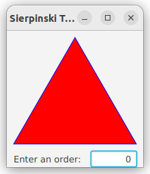
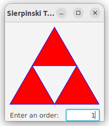
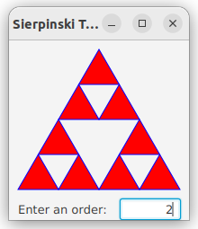
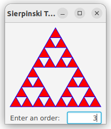
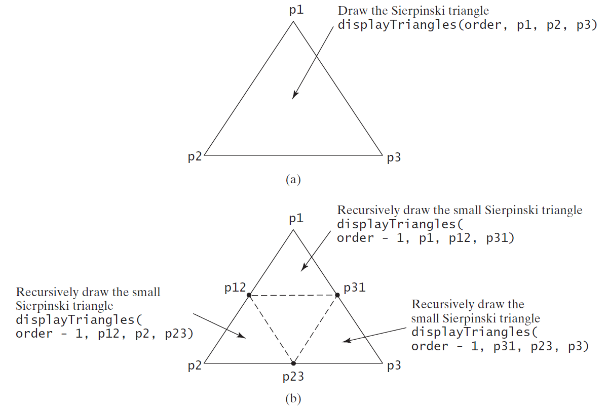

# Recursions

Motivations
---
- Process the directory *recursively*
  - find the total size of all files in a directory
  - find all files satisfy a criteria in a folder
- Generate [fractal figures](https://en.wikipedia.org/wiki/Fractal) *recursively*

| name |  figure (from Wikipedia) |
| ---- |  ------ |
| fractal canopy |  |
| Mandelbrot set |  |


Objectives
---
- Explain recursive functions and their benefits
  - divide-and-conquer
  - implemented in a call stack
  - derive a recursive function using helper functions
- Solve problems using recursion
  - recursive mathematical functions
  - selection sort
  - binary search
  - directory size
  - Tower of Hanoi
  - draw fractals
- Convert between recursion and iteration
  - tail-recursion


Recursive mathematical functions
---

| function | recursion | base cases |
| --- | --- | --- |
| factorial | $n! = n\times (n-1)!, n>0$ | $0!=1$ |
| partial sum | $f(n)=n+f(n-1), n\ge 1$  | $f(0)=0$ |
| Fibonacci numbers| $f(n) = f(n-1) + f(n-2), n\ge2$ | $f(1)=1, f(0)=0$ |


Solve recursive problems
---
- divide-and-conquer
  - break the problem into similar subproblems with smaller size
- Characteristics of Recursion
  - implemented using a conditional statement that leads to different cases
  - One or more base cases (the simplest cases) are used to stop
  - Every recursive call reduces the original problem increasingly closer to until becomes base cases

```c++
#include <iostream>

// Function to calculate factorial
int factorial(int n)
{
  if (n == 0 || n == 1)
    return 1;
  else
    return n * factorial(n - 1);
}

// Function to calculate partial sum
int partialSum(int n)
{
  if (n==0)
    return 0;
  else
    return n + partialSum(n-1);
}

// Function to calculate Fibonacci sequence
int fibonacci(int n)
{
  if (n <= 1)
    return n;
  else
    return fibonacci(n - 1) + fibonacci(n - 2);
}

int main()
{
  int n;
  std::cout << "Enter a number: ";
  std::cin >> n;

  // Calculate and output factorial
  std::cout << "Factorial of " << n << " is: " << factorial(n) << std::endl;

  // Calculate and output partial sum
  std::cout << "Partial sum of " << n << " is: " << partialSum(n) << std::endl;

  // Calculate and output Fibonacci sequence up to n terms
  std::cout << "Fibonacci sequence up to " << n << " terms: ";
  for (int i = 0; i < n; ++i)
  {
    std::cout << fibonacci(i) << " ";
  }
  std::cout << std::endl;

  return 0;
}
```

Practice 📝
---
- run the code above
  - show [call stacks](https://pythontutor.com/) of the three recursive functions
  - show call stacks on paper
- write recursive functions
  - print a message $n$ times
  - determine whether a string is a palindrome
  - [reference implementation](./demos/pp.cpp)


Recursive Helper functions
---
- recursive callee functions
- the inputs and the outputs of the problem are handled with caller functions

```c++
// Helper function to check if a substring is a palindrome using recursion
bool isPalindrome(const std::string& str, int start, int end) {
    if (start >= end) {
        return true;
    }
    if (str[start] != str[end]) {
        return false;
    }
    return isPalindrome(str, start + 1, end - 1);
}

// Function to check if a string is a palindrome
bool isPalindrome(const std::string& str) {
    return isPalindrome(str, 0, str.length() - 1);
}
```


Recursive Selection Sort
---
- Find the smallest number in the list and swaps it with the first number
- Ignore the first number and sort the remaining smaller list recursively

```c++
// Helper function to find the minimum element in a vector
int findMinIndex(const std::vector<int> &arr, int start = 0)
{
  int minIndex = start;
  for (int i = start + 1; i < arr.size(); ++i)
  {
    if (arr[i] < arr[minIndex])
    {
      minIndex = i;
    }
  }
  return minIndex;
}

// Recursive helper function to perform selection sort
void selectionSortRecursive(std::vector<int> &arr, int start = 0)
{
  if (start >= arr.size() - 1)
  {
    return;
  }
  int minIndex = findMinIndex(arr, start);
  if (minIndex != start)
  {
    std::swap(arr[start], arr[minIndex]);
  }
  selectionSortRecursive(arr, start + 1);
}

// Selection sort
void selectionSort(std::vector<int> &arr)
{
  selectionSortRecursive(arr);
}
```


Recursive Binary Search
---
- Case 1: If the key is equal to the middle element, the search ends with a match
- Case 2: If the key is less than the middle element, recursively search the key in the first half of the array
- Case 3: If the key is greater than the middle element, recursively search the key in the second half of the array

```c++
// Recursive binary search helper function
int binarySearch(const std::vector<int> &arr, int target, int left, int right)
{
  if (left > right)
  {
    return -1; // Base case: element not found
  }

  int mid = left + (right - left) / 2; // Calculate the middle index

  if (arr[mid] == target)
  {
    return mid; // Base case: element found at middle index
  }
  else if (arr[mid] < target)
  {
    // If target is greater, search in the right half
    return binarySearch(arr, target, mid + 1, right);
  }
  else
  {
    // If target is smaller, search in the left half
    return binarySearch(arr, target, left, mid - 1);
  }
}

int binarySearch(const std::vector<int> &arr, int target)
{
  return binarySearch(arr, target, 0, arr.size() - 1);
}
```


Directory Size
---
- the sum of the sizes of all files in the directory $p$ (path)
- directory $p$ may contain files $f$ and subdirectories $d$
- defined recursively as

$$size(p)=\sum_{f \in p}f + \sum_{d \in p}size(d)$$

```c++
namespace fs = std::filesystem;

// Function to calculate the size of a directory recursively
uintmax_t directorySize(const fs::path& path) {
    uintmax_t size = 0;

    for (const auto& entry : fs::recursive_directory_iterator(path)) {
        if (fs::is_regular_file(entry)) {
            size += fs::file_size(entry);
        }
    }

    return size;
}
```


[Tower of Hanoi](https://en.wikipedia.org/wiki/Tower_of_Hanoi)
---
- [normal case](https://yongdanielliang.github.io/animation/web/TowerOfHanoi.html)
- [extended case](https://towersofhanoi.info/Animate.aspx)
- There are n disks labeled 1, 2, 3, . . ., n, and three towers labeled A, B, and C
- No disk can be on top of a smaller disk at any time
- All the disks are initially placed on tower A
- Only one disk can be moved at a time, and it must be the top disk on the tower
- **Question**: how to move all disks to tower C in minimum number of steps?
- **Solution**: 
  - Move the first n - 1 disks from A to C with the assistance of tower B
  - Move disk n from A to B
  - Move n - 1 disks from C to B with the assistance of tower A

```c++
void moveDisk(int disk, char source, char destination) {
    std::cout << "Move disk " << disk << " from " << source << " to " << destination << std::endl;
}

void towerOfHanoi(int disks, char source, char auxiliary, char destination) {
    if (disks == 1) {
        moveDisk(disks, source, destination);
    } else {
        towerOfHanoi(disks - 1, source, destination, auxiliary);
        moveDisk(disks, source, destination);
        towerOfHanoi(disks - 1, auxiliary, source, destination);
    }
}
```

Greatest Common Divisor (GCD)
---
- examples
  - gcd(3,7) = 1
  - gcd(5,10) = 5
- solutions
  - Approach 1: `Brute-force`, start from min(n, m) down to 1, to check if a number is common divisor for both m and n, if so, it is the greatest common divisor
  - Approach 2: [Euclid’s algorithm](https://en.wikipedia.org/wiki/Euclidean_algorithm)
  - Approach 3: `Recursive` function


Approach 2: [Euclid’s algorithm](https://en.wikipedia.org/wiki/Euclidean_algorithm)
---
```c++
long Euclid(long m, long n) {
  if (n == 0) {
    return m;
  }

  long am = Math.abs(m);
  long an = Math.abs(n);

  long r = am % an;
  while (r != 0) {
    am = an;
    an = r;
    r = am % an;
  }
  return an;
}
```


Approach 3: Recursive function
---
```c++
long gcd(long m, long n) {
  if (n == 0)
    return m;
  else if (m % n == 0) {
    return n;
  } else {
    return gcd(n, m % n);
  }
}
```


Fractals
---
- can be divided into parts
  - each part is a reduced-size copy of the whole
- examples
  - [Mandelbrot set](https://en.wikipedia.org/wiki/Mandelbrot_set)
  - [Sierpinski triangle](https://en.wikipedia.org/wiki/Sierpi%C5%84ski_triangle)
  - [H tree](https://en.wikipedia.org/wiki/H_tree)


[Sierpinski triangle](https://en.wikipedia.org/wiki/Sierpi%C5%84ski_triangle)
---
- begin with an equilateral triangle
  - considered to be the Sierpinski fractal of order (or level) 0
- Connect the midpoints of the sides of the triangle of order 0 to create a Sierpinski triangle of order 1
- Leave the center triangle intact
  - Connect the midpoints of the sides of the three other triangles to create a Sierpinski of order 2
- repeat the same process recursively to create a Sierpinski triangle of order 3, 4, ..., and so on

| order | 0 | 1 | 2 | 3 |
| -- | -- | -- | -- | -- |
| Sierpinski triangle |  |  |  |  | 


Sierpinski Triangle Solution
---



- [source code](./demos/st2.py)


Recursion vs. Iteration
---
- Recursion is essentially repetition without a loop
- Recursion bears substantial overhead
  - the system must assign space for all of the recursive function’s local variables and parameters its called each time
  - consume considerable memory and require extra time to manage the additional space
- Recursion is good for solving inherently recursive problems 
- `tail recursion` has no pending operations to be performed on return from a recursive call
  - converted into iteration automatically by the compiler

```c++
// Helper function for factorial using tail recursion
unsigned long long factorialHelper(unsigned long long n, unsigned long long accumulator) {
    if (n == 0) {
        return accumulator;
    }
    return factorialHelper(n - 1, n * accumulator);
}

// Function to calculate factorial
unsigned long long factorial(unsigned long long n) {
    return factorialHelper(n, 1);
}
```

# References
- [Visual Studio Code show call hierarchy](https://stackoverflow.com/questions/49197137/visual-studio-code-show-call-hierarchy)
- [Liang animation](https://liveexample.pearsoncmg.com/liang/animation/animation.html)