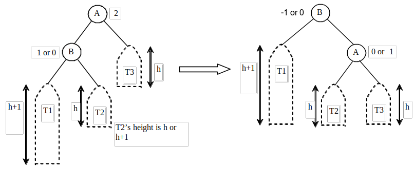
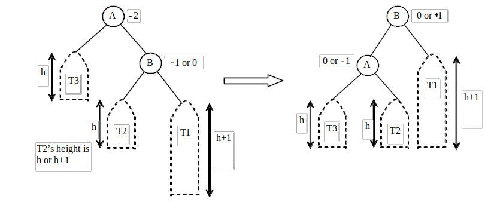
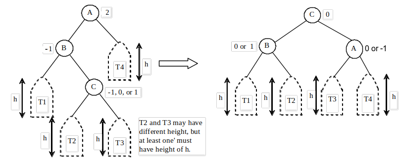
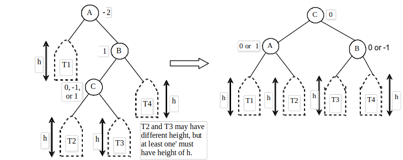

# AVL Tree ([Self-balancing BST](https://en.wikipedia.org/wiki/AVL_tree))

Objectives
---
- Explain AVL tree and design AVLTree class
- Rebalance AVL trees
  - using the LL rotation, LR rotation, RR rotation, and RL rotation
- Design, implement and analyze common operations on AVL trees
  - search, insert, and delete elements


Why AVL Tree? 
---
- The time complexity of common operations for a binary tree (BT) depend on the height of the tree
  - $O(n)$ in the worst case when the BT becomes a list
  - $O(\log n)$ when the BT is *complete*, or *perfectly balanced*
- Making a BT perfectly balances is costly
  - The compromise is making it `well-balanced` 
- AVL trees are well-balanced
  - The `difference between the heights` of two subtrees for every node is 0 or 1
  - Maximum height is $O(\log n)$


Balance Factor
---
- An AVL tree may need rebalance after inserting or deleting elements
- *balance factor of a node (bf)* = height of its `left` subtree - height of its `right` subtree
  - In an AVL tree, the balance factor of any node is in {-1,0,1}
- A node in an AVL tree is called
   -  *balanced* if its bf = 0
   -  *left-heavy* if its bf > 0
   -  *right-heavy* if its bf < 0


🏃 Exercise
---
- [Find the height and balance factor of each node in the AVL](https://csvistool.com/AVL)
- [Find the height and balance factor of each node in the BST](https://csvistool.com/BST)


Balancing an imbalanced node in an AVL
---
- Rebalancing a node A is called a *rotation*
  - `Aₗ` denotes A's `left` child and `Aᵣ` denote A's `right` child
- Four possible rotations for four possible imbalances
  - A `single right rotation` at A for `left-left` imbalance `(0|1,2, -)` or left-left heavy
    - denoted it as `Rᵣ(A)`
    - $(bf_{A_l}, bf_A, bf_{A_r})$ = `(0|1,2, -)`
      - a single `-` represents `don't care`, which could be `-1|0|1`
  - A s`ingle left rotation` at A for `right-right` imbalance `(-,-2,-1|0)` or right-right heavy
    - denoted it as `Rₗ(A)`
  - `A Rₗ(Aₗ) followed by a Rᵣ(A)` for `left-right` imbalance `(-1,2,-)` or left-right heavy
  - `A Rᵣ(Aᵣ) followed by a Rₗ(A)` for `right-left` imbalance `(-,-2,1)` or right-left heavy


Right rotation for LL imbalance
---
- `LL imbalance` occurs at a node A when
  - $bf_A = 2$ and $bf_{A_l} \in \{0,1\}$
  - `(0|1,2, -)`
- can be fixed by a `single right rotation` at A
- 

```c++
RightRotate(A):
    B = A.left
    T2 = B.right
    B.right = A
    A.left = T2
    A.height = max(height(A.left), height(A.right)) + 1
    B.height = max(height(B.left), height(B.right)) + 1
    return B
```


Left rotation for RR imbalance
---
- `RR imbalance` occurs at a node A when
  - $bf_A = -2$ and $bf_{A_r} \in \{0,-1\}$
  - `(-,-2,-1|0)`
- can be fixed by a `single left rotation` at A
- 
```c++
LeftRotate(A):
    B = A.right
    T2 = B.left
    B.left = A
    A.right = T2
    A.height = max(height(A.left), height(A.right)) + 1
    B.height = max(height(B.left), height(B.right)) + 1
    return B
```

LR rotation for LR imbalance
---
- `LR imbalance` occurs at a node A when
  - $bf_A = 2$ and $bf_{A_l} = -1$
  - `(-1,2,-)`
- can be fixed by a double rotation
  - a single left rotation at Aₗ
  - a single right rotation at A
- 
```c++
LeftRightRotate(A):
    A.left = LeftRotate(A.left)
    return RightRotate(A)
```

RL rotation for RL imbalance
---
- `RL imbalance` occurs at a node A when
  - $bf_A = -2$ and $bf_{A_r} = 1$
  - `(-,-2,1)`
- can be fixed by a double rotation
  - a single right rotation at Aᵣ
  - a single left rotation at A
- 
```c++
RightLeftRotate(A):
    A.right = RightRotate(A.right)
    return LeftRotate(A)
```


💡 Intuition
---
- [Animate all 4 imbalances and their rotations](https://csvistool.com/AVL)
  - To cause a left rotation, add 1, 2 and 3, in that order
  - To cause a right rotation, add 3, 2 and 1, in that order
  - To cause a left-right rotation, add 3, 1 and 2, in that order
  - To cause a right-left rotation, add 1, 3 and 2, in that order


🏃 Implementation
---
```c++
#include <iostream>
#include <string>
#include <sstream>
#include <algorithm>

template <typename T>
class AVL
{
  struct Node
  {
    T data;
    Node *left;
    Node *right;
    int height;
    Node(T value) : data(value), left(nullptr), right(nullptr), height(1) {}
  };

  Node *root;

  int height(Node *N)
  {
    return N ? N->height : 0;
  }

  int getBalance(Node *N)
  {
    return N ? height(N->left) - height(N->right) : 0;
  }

  std::string imbalance(Node *N)
  {
    std::stringstream ss;
    ss << "(" <<getBalance(N->left)<<","<<getBalance(N)<<","<<getBalance(N->right) << ")";
    return ss.str();
  }

  Node *rightRotate(Node *A)
  {
    Node *B = A->left;
    Node *T2 = B->right;
    std::cout << "Right rotation at node(" << A->data << ") for LL imbalance "<<imbalance(A)<<std::endl;
    B->right = A;
    A->left = T2;
    A->height = std::max(height(A->left), height(A->right)) + 1;
    B->height = std::max(height(B->left), height(B->right)) + 1;
    return B;
  }

  Node *leftRotate(Node *A)
  {
    Node *B = A->right;
    Node *T2 = B->left;
    std::cout << "Left rotation at node(" << A->data << ") for RR imbalance "<<imbalance(A)<<std::endl;
    B->left = A;
    A->right = T2;
    A->height = std::max(height(A->left), height(A->right)) + 1;
    B->height = std::max(height(B->left), height(B->right)) + 1;
    return B;
  }

  Node *insert(Node *node, T key)
  {
    if (!node)
      return new Node(key);
    if (key < node->data)
      node->left = insert(node->left, key);
    else if (key > node->data)
      node->right = insert(node->right, key);
    else
      return node;

    node->height = 1 + std::max(height(node->left), height(node->right));
    int balance = getBalance(node);

    if (balance > 1 && key < node->left->data)
      return rightRotate(node);

    if (balance < -1 && key > node->right->data)
      return leftRotate(node);

    if (balance > 1 && key > node->left->data)
    {
      node->left = leftRotate(node->left);
      return rightRotate(node);
    }

    if (balance < -1 && key < node->right->data)
    {
      node->right = rightRotate(node->right);
      return leftRotate(node);
    }

    return node;
  }

  Node *minValueNode(Node *node)
  {
    Node *current = node;
    while (current->left != nullptr)
      current = current->left;
    return current;
  }

  Node *deleteNode(Node *root, T key)
  {
    if (root == nullptr)
      return root;

    if (key < root->data)
      root->left = deleteNode(root->left, key);
    else if (key > root->data)
      root->right = deleteNode(root->right, key);
    else
    {
      if ((root->left == nullptr) || (root->right == nullptr))
      {
        Node *temp = root->left ? root->left : root->right;

        if (temp == nullptr)
        {
          temp = root;
          root = nullptr;
        }
        else
          *root = *temp;

        delete temp;
      }
      else
      {
        Node *temp = minValueNode(root->right);
        root->data = temp->data;
        root->right = deleteNode(root->right, temp->data);
      }
    }

    if (root == nullptr)
      return root;

    root->height = 1 + std::max(height(root->left), height(root->right));
    int balance = getBalance(root);

    if (balance > 1 && getBalance(root->left) >= 0)
      return rightRotate(root);

    if (balance > 1 && getBalance(root->left) < 0)
    {
      root->left = leftRotate(root->left);
      return rightRotate(root);
    }

    if (balance < -1 && getBalance(root->right) <= 0)
      return leftRotate(root);

    if (balance < -1 && getBalance(root->right) > 0)
    {
      root->right = rightRotate(root->right);
      return leftRotate(root);
    }

    return root;
  }

  void preOrder(Node *root)
  {
    if (root != nullptr)
    {
      std::cout << root->data << " ";
      preOrder(root->left);
      preOrder(root->right);
    }
  }

public:
  AVL() : root(nullptr) {}

  void insert(T key)
  {
    root = insert(root, key);
  }

  void deleteKey(T key)
  {
    root = deleteNode(root, key);
  }

  void preOrder()
  {
    preOrder(root);
    std::cout << std::endl;
  }

  void draw(std::string indent, Node *tree, char sign = ' ')
  {
    if (tree)
    {
      draw(indent + "   ", tree->right, ',');
      std::cout << indent + sign + "--" << tree->data << std::endl;
      draw(indent + "   ", tree->left, '`');
    }
  }

  void draw()
  {
    draw("", root);
    std::cout << std::endl;
  }   
};

int main()
{
  std::cout<<"----1.Right rotation for LL imbalance----"<<std::endl;
  AVL<int> ll;
  ll.insert(3); ll.draw();
  ll.insert(2); ll.draw();
  ll.insert(1); ll.draw();
  std::cout<<"Self-balanced: "; ll.preOrder(); std::cout << std::endl;

  std::cout<<"----2.Left rotation for RR imbalance----"<<std::endl;
  AVL<int> rr;
  rr.insert(1); rr.draw();
  rr.insert(2); rr.draw();
  rr.insert(3); rr.draw();
  std::cout<<"Self-balanced: "; rr.preOrder(); std::cout << std::endl;

  std::cout<<"----3.LR rotation for LR imbalance----"<<std::endl;
  AVL<int> lr;
  lr.insert(3); lr.draw();
  lr.insert(1); lr.draw();
  lr.insert(2); lr.draw();
  std::cout<<"Self-balanced: "; lr.preOrder(); std::cout << std::endl;

  std::cout<<"----4.RL rotation for RL imbalance----"<<std::endl;
  AVL<int> rl;
  rl.insert(1); rl.draw();
  rl.insert(3); rl.draw();
  rl.insert(2); rl.draw();
  std::cout<<"Self-balanced: "; rl.preOrder(); std::cout << std::endl;

  std::cout<<"----5. Mixed rotations---------------------"<<std::endl;
  AVL<int> tree;
  tree.insert(9); tree.draw();
  tree.insert(5); tree.draw();
  tree.insert(10); tree.draw();
  tree.insert(0); tree.draw();
  tree.insert(6); tree.draw();
  tree.insert(11); tree.draw();
  tree.insert(-1); tree.draw();
  tree.insert(1); tree.draw();
  tree.insert(2); tree.draw();

  std::cout << "Preorder traversal of the constructed AVL tree is \n";
  tree.preOrder();
  std::cout << std::endl;

  tree.deleteKey(10);
  std::cout << "Preorder traversal after deletion of 10 \n";
  tree.preOrder();
  tree.draw();

  return 0;
}
```

# Online resources
- [visualgo](https://visualgo.net/)
- [Liang animation](https://liveexample.pearsoncmg.com/liang/animation/animation.html)