# 2-4 Tree and B-Tree

Objectives
---
- Compare, design and implement 2-4 tree and B-tree
  - common operations 
    - traverse a 2-4 tree
    - search elements
    - insert elements
      - split nodes
    - delete elements
      - transfer and fuse node
- Index large amount of data by B-trees


What is a [2-4 Tree](https://en.wikipedia.org/wiki/2%E2%80%933%E2%80%934_tree)? 
---
- **Node Structure**: Each node can have 1, 2, or 3 keys and accordingly can have 2, 3, or 4 children
  - so shorter than a corresponding BST
  - Also called `2-3-4 tree` by the `numbers of children` of node types
- **Order**: The order is 4, meaning each node can have a maximum of 3 keys and 4 children.
- **Balanced**: Strictly balanced, meaning all leaf nodes are at the same level
- **Node Types**:
  - **2-node**: 1 key, 2 children.
  - **3-node**: 2 keys, 3 children.
  - **4-node**: 3 keys, 4 children.
  - 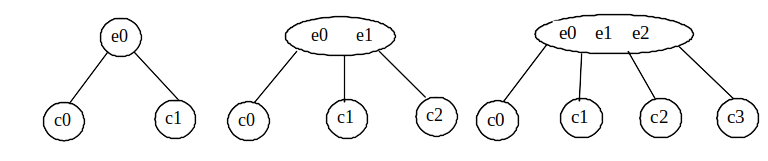
  - order of elements
    - $E(c_0) \lt e_0 \lt E(c_1) \lt e_1 \lt E(c_2) \lt e_2 \lt E(c_3)$
      - $E(c_k )$ denotes the set of all the elements in $c_k$ 
      - $c_k$ = the `left subtree` of $e_k$
      - $c_{k + 1}$ = the `right subtree` of $e_k$
- **Operations**:
  - **Insertion**: If a node is full, it splits into two nodes, propagating a key to the parent
  - **Deletion**: Ensures that nodes are balanced by borrowing keys from siblings or merging nodes as needed

🍎 Example
```
    [10, 20]
   /   |   \
[5]  [15]  [25, 30]
```

💡 Intuition
---
- [2-4 tree animation](https://csvistool.com/BTree)
- other animators
  - [a](https://liveexample.pearsoncmg.com/dsanimation13ejava/24Tree.html)
  - [b](https://kubokovac.eu/gnarley-trees/234tree.html)


🏃 Implementing Node
---
```c++
  struct Node
  {
  std::vector<T> keys;
  std::vector<Node *> children;
  Node *parent;

  Node() : parent(nullptr) {}

  bool isLeaf() const
  {
    return children.empty();
  }

  bool isFull() const
  {
    return keys.size() == 3;
  }

  void insertKey(const T &key)
  {
    // std::upper_bound: 
    // Finds the last position in which key could be inserted without changing the ordering
    keys.insert(std::upper_bound(keys.begin(), keys.end(), key), key);
  }

  void removeKey(const T &key)
  {
    auto it = std::find(keys.begin(), keys.end(), key);
    if (it != keys.end())
    {
      keys.erase(it);
    }
  }
};
```


Searching for an element 
---
- Start from the root and scan downward
- Search within a node
  - If not in the node, move to an appropriate subtree
- Repeat the process until 
  - a match is found or 
  - arrive at an empty subtree


🏃 Search implementation
---
```c++
bool search(Node *node, const T &key) const
{
  if (node == nullptr)
    return false;
  // std::lower_bound:
  // Finds the first position where a value can be inserted while maintaining sorted order
  auto it = std::lower_bound(node->keys.begin(), node->keys.end(), key);
  if (it != node->keys.end() && *it == key)
  {
    return true;
  }
  if (node->isLeaf())
  {
    return false;
  }
  return search(node->children[it - node->keys.begin()], key);
}

bool search(const T &key) const
{
  return search(root, key);
}
```


C++ STL functions `std::upper_bound, std::lower_bound, and std::find`
---
| Feature   | `std::upper_bound`   | `std::lower_bound`   | `std::find`    |
|-------|--------|--------|-------|
| Purpose  | Finds the first position where a value would be inserted after any equivalent values. | Finds the first position where a value can be inserted while maintaining sorted order. | Finds the first occurrence of a value in a range. |
| Complexity | **O(log n)** for sorted ranges (binary search).   | **O(log n)** for sorted ranges (binary search). | **O(n)** (linear search).   |
| Requirements   | Requires a sorted range for binary search efficiency.  | Requires a sorted range for binary search efficiency.   | No sorting requirement.   |
| Return Value   | Iterator to the first element greater than the given value. | Iterator to the first element not less than the given value. | Iterator to the first element that matches the given value, or the end iterator if not found. |
| Usage with Sorted Data  | Suitable for finding the position to insert after all equivalent elements in sorted data. | Suitable for binary search in sorted data.   | Not optimized for sorted data.   |
| Comparison Function     | Can use custom comparison function (optional). | Can use custom comparison function (optional).  | Can use custom comparison function (optional). |
| Typical Use Case | Efficiently finding the end of a range of equal elements in sorted data. | Efficiently finding the position to insert or check presence in sorted data. | Checking for existence or finding the first occurrence in unsorted data. |
| Header  | `<algorithm>`  | `<algorithm>`  | `<algorithm>` |


🏃 Practice: Search for elements in a 2-4 tree
---
- Create a 2-4 tree on [the animator](https://csvistool.com/BTree) randomly
- Search for existent elements and non-existent elements in various cases you can image


Inserting an element ℯ
---
- Locate a leaf node for insertion, if the leaf node is a
  - 2-node or 3-node, insert the element $e$
  - 4-node, perform a `split` operation to `avoid overflow`
    - suppose $e_0 \lt e \lt e_1$
    - if the parent of this leaf 4-node is a 3-node
      - 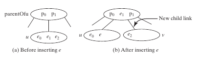
    - if the parent  of this leaf 4-node is a 4-node
      - split the parent node as splitting a leaf 4-node
      - insert the element along with its right child
      - 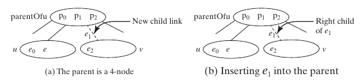
- The algorithm
  - 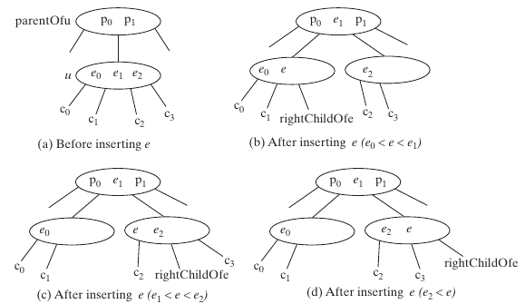
  - Let $u$ be the 4-node (*leaf or nonleaf*) in which the element $e$ will be inserted and the $P_u$ be the parent of $u$ as shown in (a) above
  - Create a new node named $v$, move $e_2$ and its children $c_2$ and $c_3$ to $v$
  - If $e \lt e_1$, insert $e$ along with its right child link to $u$; otherwise insert $e$ along with its right child link to $v$, as shown in (b),(c),(d) for the cases $e_0  \lt  e  \lt  e_1, e_1  \lt e \lt e_2, e_2 \lt e$ respectively
  - Insert $e_1$ along with its right child $v$ to the parent node, *recursively*


🏃 Practice: Insert elements into a 2-4 tree
---
Describe the tree changes while inserting each element:
- Create a 2-4 tree on [the animator](https://csvistool.com/BTree) by inserting 34,3,50,20,15,16,25,27,29,24 into an empty tree one by one
- Insert an element into a 2-,3-node respectively
- Insert an element into a 4-node whose parent is a 3-node and a 4-node respectively
  - one case is missing from above: $e<e_0$


🏃 Insert implementation
---
```c++
void split(Node *node)
{
  if (!node->isFull())
    return;

  T middleKey = node->keys[1];
  Node *newLeft = new Node();
  Node *newRight = new Node();

  newLeft->keys.push_back(node->keys[0]);
  newRight->keys.push_back(node->keys[2]);

  if (!node->isLeaf())
  {
    newLeft->children.push_back(node->children[0]);
    newLeft->children.push_back(node->children[1]);
    newRight->children.push_back(node->children[2]);
    newRight->children.push_back(node->children[3]);
    for (auto *child : newLeft->children)
    {
      child->parent = newLeft;
    }
    for (auto *child : newRight->children)
    {
      child->parent = newRight;
    }
  }

  if (node == root)
  {
    root = new Node();
    root->keys.push_back(middleKey);
    root->children.push_back(newLeft);
    root->children.push_back(newRight);
    newLeft->parent = root;
    newRight->parent = root;
  }
  else
  {
    Node *parent = node->parent;
    parent->insertKey(middleKey);
    parent->children.erase(std::find(parent->children.begin(), parent->children.end(), node));
    parent->children.push_back(newLeft);
    parent->children.push_back(newRight);
    std::sort(parent->children.begin(), parent->children.end(), [&](Node *a, Node *b)
              { return a->keys[0] < b->keys[0]; });
    newLeft->parent = parent;
    newRight->parent = parent;
  }
  delete node;
}

void insert(Node *node, const T &key)
{
  if (node->isLeaf())
  {
    node->insertKey(key);
    split(node);
  }
  else
  {
    auto it = std::upper_bound(node->keys.begin(), node->keys.end(), key);
    insert(node->children[it - node->keys.begin()], key);
  }
}
void insert(const T &key)
{
  insert(root, key);
}  
```


Deleting an element ℯ
---
- Search for and locate the node $u$ that contains the element $e$
  - return false if not found
  - found the node $u$ and its parent $P_u$
    - **Case 1**: $u$ is a leaf 3- or 4- node, delete $e$ from $u$
    - **Case 2**: $u$ is a leaf 2-node, delete e renders $u$ empty, called `underflow`, which can be remedied
      - Case 2.1: 
        - (a) if $u$'s immediate left or right sibling $w$ is a 3- or 4- node
        - (b) *transfer* an element from $P_u$ to $u$
        - (c) move an element from $w$ to occupy the hole in $P_u$
        - 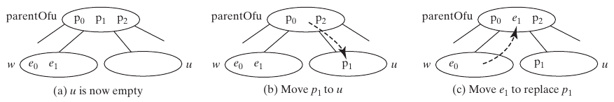
      - Case 2.2: if both $u$'s immediate left $w$ and right siblings are 2-node and exist ($u$ may have only one sibling)
        - perform a *fusion* operation to discard $u$ and move an element from $P_u$ to $w$
          - If $P_u$ becomes empty, repeat Case 2 recursively on it with *transfer and fusion*
        - 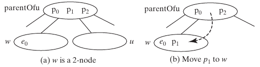
    - **Case 3**: $u$ is a nonleaf node
      - find the rightmost leaf node $w$ in the left subtree of $e$
      - move the last element in $w$ to replace $e$ in $u$
        - if $w$ becomes empty, apply a *transfer or fusion* operation on $w$
      - 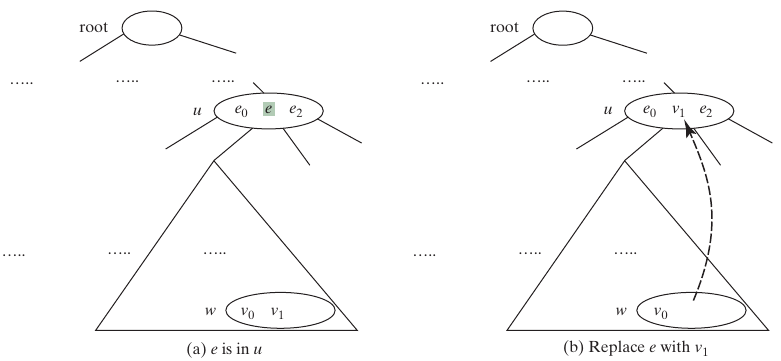


🏃 Practice: Delete elements from a 2-4 tree
---
- Create a 2-4 tree on [the animator](https://csvistool.com/BTree) by inserting into an empty tree one by one with 1, 2, 3, 4, 10, 9, 7, 5, 8, 6, 17, 25, 18, 26, 14, 52, 63, 74, 80, 19,  27
- Describe the *transfer and fusion* operations happened while deleting the elements in order 1, 2, 3, 4, 10, 9, 7, 5, 8,  6


🏃 Delete implementation
---
```c++
  void remove(Node *node, const T &key)
  {
    if (node->isLeaf())
    {
      removeLeaf(node, key);
    }
    else
    {
      removeInternal(node, key);
    }

    if (node == root && node->keys.empty())
    {
      if (node->children.size() > 0)
      {
        root = node->children[0];
        root->parent = nullptr;
        delete node;
      }
    }
  }

  void removeLeaf(Node *node, const T &key)
  {
    node->removeKey(key);
  }

  void removeInternal(Node *node, const T &key)
  {
    auto it = std::find(node->keys.begin(), node->keys.end(), key);
    Node *child = node->children[it - node->keys.begin()];
    if (child->keys.size() >= 2)
    {
      T predecessor = child->keys.back();
      remove(child, predecessor);
      node->keys[it - node->keys.begin()] = predecessor;
    }
    else
    {
      child = node->children[it - node->keys.begin() + 1];
      T successor = child->keys.front();
      remove(child, successor);
      node->keys[it - node->keys.begin()] = successor;
    }
  }  
```


Traverse a 2-4 tree
---
- A 2-4 tree can be traversed with  inorder, preorder, postorder and level-order
  - Inorder traversal visits the elements in increasing order
  - Preorder traversal visits the elements in the root, 
     - then recursively visits the subtrees from the left to right
  - Postorder traversal visits the subtrees from the left to right recursively, 
     - then the elements in the root
  - Level-order traversal visits the tree from top to bottom, from left to right


🏃 Practice: Traverse a 2-4 tree
---
- Print out the elements while traversing the 2-4 tree below
  - 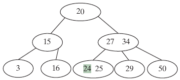
  - inorder prints?
  - preorder prints?
  - postorder prints?
  - level-order prints?


Implement2-4 tree in C++ template
---
- [source code](./demos/tree24.cpp)


Time-complexity analysis
---

| operation | time complexity |
| --- | --- |
| search | $O(\log n)$ |
| insert | $O(\log n)$ |
| delete | $O(\log n)$ |

- Analysis
  - the height of a 2-4 tree: $O(\log n)$
  - search, insert, and delete methods operate on the nodes along a *path* in the tree
    - search an element within a node: $O(1)$
    - split a node: $O(1)$
    - transfer and fusion operations: $O(1)$


What is a [B-Tree](https://en.wikipedia.org/wiki/B-tree) of order 𝒹? 
---
- A generalization of the 2-4 tree
- Used to organize data stored on secondary storage such as hard disks
- A b-tree of order 6
- 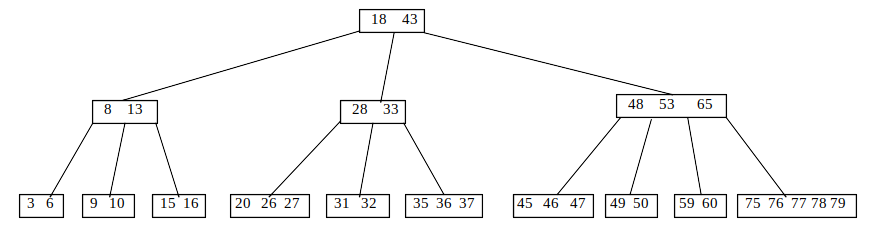
- Each non-root node contains from $⌈\dfrac{d}{2}⌉ -1$ to $d-1$ keys
  - A 2-4 tree is a B-tree of order 4
- The root may contain from 0 to $d-1$ keys
- A nonleaf node with $k$ keys has $k+1$ children
- All leaf nodes have the same depth


A B-tree is a search tree
---
- 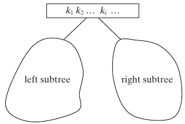
-  The keys in each node are placed in *increasing* order
-  Each key in an interior node has a left subtree and a right subtree
-  All keys in the left subtree are less than the key in the parent node
-  All keys in the right subtree are greater than the key in the parent node


Insert a key into a B-tree
---
- Locate the leaf node $u$ then insert the key $k$
- Perform a *split* operation to fix *overflow* 
  - when the leaf node $u$ has $d$ keys after the insertion
    - let $k_p$ denote the median key in $u$
  - create a new node $v$ and move all keys greater than $k_p$ to it
  - insert $k_p$ to the parent node $P_u$ of $u$
    - now $u$ becomes the left child of $k_p$
    - $v$ becomes the right child of $k_p$
    - if this insertion causes an *overflow* on $P_u$
      - repeat similar split process on $P_u$
  - 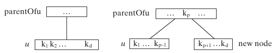
- common operations such as insert, delete, search, traverse are similar to 2-4 tree
  - can be generalized from those of 2-4 tree


Delete a key from a B-tree
---
- Locate the node $u$ that contains the key $k$
  - **Case 1**: $u$ is a leaf node, remove $k$ from $u$
    - *underflow* occurs when $u$ has less than $⌈\dfrac{d}{2}⌉ -1$ keys, to remedy it
      - perform a *transfer* with a sibling $w$ of $u$ has more than $⌈\dfrac{d}{2}⌉ -1$ keys if such sibling exists
        - 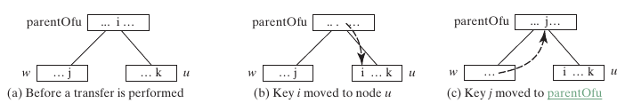
      - otherwise, perform a fusion with a sibling $w$ of $u$
        - 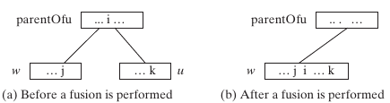
  - **Case 2**: $u$ is a nonleaf node
    - find the rightmost leaf node $w$ in the left subtree of $k$
    - move the last key $i$ in $w$ to replace $k$ in $u$
      - 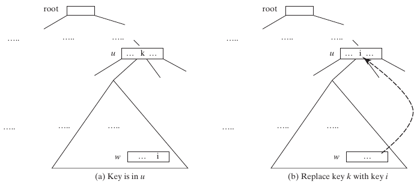
    - if $w$ becomes *underflow*, apply a *transfer or fusion* operation


🏃 Implementation of B-tree
---
- [source code](./demos/btree.cpp)


B-tree performance
---
- Improve performance by reducing the number of disk I/Os
   - Disk I/O is thousands of times slower than memory access
   - The basic unit of the IO operations on a disk is a block
      - choose an appropriate order $d$ so that a node can fit in a single disk block
   - common operations depends on the height of the B-tree 
     - worst case: each node contains $⌈\dfrac{d}{2}⌉-1$ keys so the height of the B-tree is $\log_{⌈\dfrac{d}{2}⌉}n$
     - best case: each node contains $d-1$ keys so the height of the B-tree is $\log_d n$


Comparison of 2-4 tree and B-tree
---
| Feature   | 2-4 Tree   | B-Tree  |
|----|-----|------|
| Node Keys | 1, 2, or 3 keys   | Between `t-1` and `2t-1` keys  |
| Node Children  | 2, 3, or 4 children  | Between `t` and `2t` children            |
| Balancing | Strictly balanced (all leaves at same level) | Height-balanced (leaves may not be at the same level) |
| Order  | Fixed (4)     | Variable, determined by minimum degree `t` |
| Usage Complexity   | Simpler to implement  | More flexible, used in databases and filesystems |
| Splitting and Merging | Directly handled | Requires more general handling of node sizes |


Conclusion
---
- **2-4 Trees** are a specific case of B-Trees with a fixed order of 4. They are strictly balanced, ensuring that all leaf nodes are at the same level, which simplifies certain operations but reduces flexibility.
- **B-Trees** are more general and flexible, allowing a variable number of keys and children per node. They are widely used in practical applications like databases and filesystems due to their flexibility and efficiency in handling large datasets.

In summary, a 2-4 tree can be viewed as a specific type of B-Tree with order 4. The main difference lies in the flexibility and the range of the minimum degree, with B-Trees providing a more general approach suitable for various applications.
