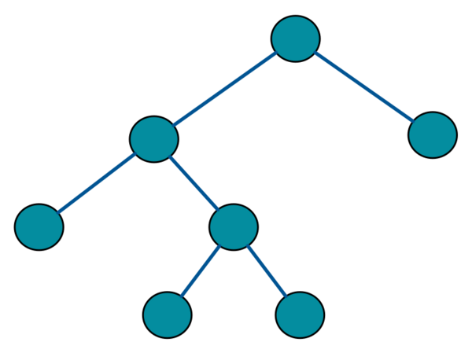

# Trees

💡 Intuition
---


Terms about trees
---
<table border="1">
  <tr>
    <th>Concept</th>
    <th>Description</th>
    <th>Example</th>
  </tr>
  <tr>
    <td>Root</td>
    <td>The topmost node in a tree, without parents.</td>
    <td>In a family tree, the earliest ancestor.</td>
  </tr>
  <tr>
    <td>Leaf</td>
    <td>A node with no children.</td>
    <td>In a file system, a file without subdirectories.</td>
  </tr>
  <tr>
    <td>Edge</td>
    <td>The connection between one node and another.</td>
    <td>The link from a parent node to a child node.</td>
  </tr>
  <tr>
    <td>Child</td>
    <td>A node directly connected to another node when moving away from the Root.</td>
    <td>In a company hierarchy, an employee directly under a manager.</td>
  </tr>
  <tr>
    <td>Parent</td>
    <td>A node directly connected to another node when moving towards the Root.</td>
    <td>In a company hierarchy, the manager of an employee.</td>
  </tr>
  <tr>
    <td>Sibling</td>
    <td>Nodes that share the same Parent.</td>
    <td>In a family tree, brothers and sisters.</td>
  </tr>
    <tr>
    <td>Neighbor</td>
    <td>Adjacent nodes connected directly by an edge.</td>
    <td>In a network topology, two nodes connected by a single network cable.</td>
  </tr>
  <tr>
    <td>Ancestor</td>
    <td>Any predecessor node on the path from the node to the root.</td>
    <td>In a family tree, all the forefathers of a person.</td>
  </tr>
  <tr>
    <td>Descendant</td>
    <td>Any successor node on the path from the node to any leaf.</td>
    <td>In a family tree, all the offspring of a person.</td>
  </tr>
  <tr>
    <td>Subtree</td>
    <td>A tree entirely contained within another tree.</td>
    <td>A department within a larger company's organizational chart.</td>
  </tr>
  <td>Degree of Node</td>
    <td>The number of children of a node.</td>
    <td>In a binary tree, each node has a degree of at most 2.</td>
  </tr>
  <tr>
    <td>Degree of Tree</td>
    <td>The maximum degree of any node in the tree.</td>
    <td>In a binary tree, the degree of the tree is 2.</td>
  </tr>
  <tr>
    <td>Width</td>
    <td>The maximum number of nodes at any level in the tree.</td>
    <td>The number of departments on a particular floor of a company.</td>
  </tr>
  <tr>
    <td>Breadth</td>
    <td>The total number of leaf nodes in the tree.</td>
    <td>The total number of end-points in a network topology.</td>
  </tr>
  <tr>
    <td>Size</td>
    <td>The total number of nodes in the tree.</td>
    <td>The total number of employees in a company.</td>
  </tr>  
  <tr>
    <td>Path</td>
    <td>A sequence of nodes and edges connecting a node with a descendant, where each adjacent pair of nodes is connected by an edge.</td>
    <td>For example, in a binary tree, the path from the root node to a leaf node might be Root -> A -> B -> Leaf.</td>
  </tr>
  <tr>
    <td>Path Length</td>
    <td>The number of edges in a path.</td>
    <td>If the path is Root -> A -> B -> Leaf, the path length is 3.</td>
  </tr>  
  <tr>
    <td>Depth</td>
    <td>The number of edges from the Root to the node.</td>
    <td>The number of generations from the earliest ancestor to a descendant in a family tree.</td>
  </tr>
  <tr>
    <td>Height</td>
    <td>The number of edges on the longest path from the node to a leaf.</td>
    <td>The number of levels of management from a manager down to the lowest employee.</td>
  </tr>
  <tr>
  <tr>
    <td>Distance</td>
    <td>The number of edges in the shortest path between two nodes.</td>
    <td>The distance between two cousins in a family tree.</td>
  </tr>
  <tr>
    <td>Level</td>
    <td>The number of edges from the root to the node.</td>
    <td>The level of a manager in a company's organizational structure.</td>
  </tr>
</table>


# Binary Trees (BTs) and Binary Search Trees (BSTs)

💡 Intuition
---
- [BST slow simulation](https://liveexample.pearsoncmg.com/dsanimation13ejava/BSTeBook.html)
- [BST fast simulation](https://cmps-people.ok.ubc.ca/ylucet/DS/BST.html)
- [BST speed-adjustable simulation](https://web.eecs.utk.edu/~czheng4/viz/animations/tree_structures/binary_search_tree/bst.html)

Binary Trees vs. Binary Search Trees
---
| Feature | [Binary Tree]((https://en.wikipedia.org/wiki/Binary_tree)) | [Binary Search Tree (BST)](https://en.wikipedia.org/wiki/Binary_search_tree) |
|---------|-------------|--------------------------|
| **Illustration** |  |   |
| **Definition** | A tree data structure where each node can have `at most two children` nodes. | A binary tree in which for each node, all elements in its `left subtree` are `less` than the node, and all elements in its `right subtree` are `greater than` the node. |
| **Node Insertion** | Nodes are inserted without any specific order. | Nodes are inserted according to their values, maintaining the BST property. |
| **Node Lookup/Search** | No specific order; full tree traversal may be needed to find a node. | Efficient lookup using the binary search property, reducing the search space by half at each step. |
| **Time Complexity (average case)** | $O(n)$ for insertion, deletion, and search. | $O(h)$ for insertion, deletion, and search, where h is the height of the tree. |
| **Space Complexity** | $O(n)$ as it only depends on the number of nodes in the tree. | $O(n)$ as it only depends on the number of nodes in the tree. |
| **Application** | Used in various tree-related algorithms and data structures. | Ideal for applications where efficient search, insertion, and deletion are required, such as in databases and dictionaries. |


Full Binary Tree vs. Complete Binary Tree
---
| Feature  | Full Binary Tree   | Complete Binary Tree   |
|-----|------|-------|
| **Illustration** |  |  |
| **Definition** | A binary tree where every node has either `0 or 2 children`. | A binary tree in which all levels are `completely filled except` possibly `the last`, which is filled `from left to right`. |
| **Node Properties** | Each node has exactly two children or none.  | Each level, except the last, is completely filled. Nodes in the last level are as far left as possible. |
| **Shape**  | Can be skewed if nodes only have one child direction, but still requires each node to have two or no children. | Tends to be more balanced as it fills from left to right.  |
| **Height**  | Height can vary. The minimum height is $\log(n+1)-1$.  | Height is minimized. The tree is as compact as possible.|
| **Examples**  | A tree with nodes having 0 or 2 children, like expression trees. | A binary heap is a complete binary tree and used in heap sort. |


The insert, delete, and search operations in a BST
---
| Operation | Description | Time Complexity | Notes |
|-----------|-------------|-----------------|-------|
| **Insert** | Inserts a new node with a specific value. The new node is always inserted at a leaf. | Average: $O(\log n)$<br>Worst: $O(n)$ | The tree starts from the root and the new node is inserted on the left if it's smaller than the current node, or on the right if it's larger. |
| **Delete** | Removes a node with a specific value. This can involve replacing the node with its `in-order successor or predecessor` if it has two children. | Average: $O(\log n)$<br>Worst: $O(n)$ | After deletion, the properties of the BST must be maintained. |
| **Search** | Looks for a node with a specific value. | Average: $O(\log n)$<br>Worst: $O(n)$ | Starts from the root and traverses left or right depending on whether the value is smaller or larger than the current node. |


🍎 Implementation
---
```c++
#include <iostream>

// Define a Binary Search Tree (BST) class
template <typename T>
class BST
{
private:
  struct Node
  {
    T data;
    Node *left;
    Node *right;
    Node(const T &val) : data(val), left(nullptr), right(nullptr) {}
  };

  Node *root;

  // Helper function for inserting a new node
  Node *insertHelper(Node *node, const T &val)
  {
    if (!node)
    {
      return new Node(val);
    }
    if (val < node->data)
    {
      node->left = insertHelper(node->left, val);
    }
    else if (val > node->data)
    {
      node->right = insertHelper(node->right, val);
    }
    return node;
  }

  // Helper function for searching a value
  bool searchHelper(Node *node, const T &val) const
  {
    if (!node)
    {
      return false;
    }
    if (val == node->data)
    {
      return true;
    }
    else if (val < node->data)
    {
      return searchHelper(node->left, val);
    }
    else
    {
      return searchHelper(node->right, val);
    }
  }

  // Helper function to find the minimum value node
  Node *findMin(Node *node)
  {
    while (node->left)
    {
      node = node->left;
    }
    return node;
  }

  // Helper function for deleting a node
  Node *deleteHelper(Node *node, const T &val)
  {
    if (!node)
    {
      return nullptr;
    }
    if (val < node->data)
    {
      node->left = deleteHelper(node->left, val);
    }
    else if (val > node->data)
    {
      node->right = deleteHelper(node->right, val);
    }
    else
    {
      if (!node->left)
      {
        Node *temp = node->right;
        delete node;
        return temp;
      }
      else if (!node->right)
      {
        Node *temp = node->left;
        delete node;
        return temp;
      }
      Node *temp = findMin(node->right);
      node->data = temp->data;
      node->right = deleteHelper(node->right, temp->data);
    }
    return node;
  }

public:
  BST() : root(nullptr) {}

  // Public method to insert a value into the BST
  void insert(const T &val)
  {
    root = insertHelper(root, val);
  }

  // Public method to search for a value in the BST
  bool search(const T &val) const
  {
    return searchHelper(root, val);
  }

  // Public method to delete a value from the BST
  void remove(const T &val)
  {
    root = deleteHelper(root, val);
  }
};

int main()
{
  BST<int> bst;
  bst.insert(10);
  bst.insert(5);
  bst.insert(15);

  std::cout << "Search 10: " << (bst.search(10) ? "Found" : "Not found") << std::endl;
  std::cout << "Search 7: " << (bst.search(7) ? "Found" : "Not found") << std::endl;

  bst.remove(10);
  std::cout << "Search 10 after deletion: " << (bst.search(10) ? "Found" : "Not found") << std::endl;

  return 0;
}
```

# References
- [Depth First Traversal: Inorder, Preorder and Postorder tree traversals - Animated guide](https://csanim.com/tutorials/inorder-preorder-and-postorder-tree-traversals-animated-guide)
- [Breadth-first search (BFS) of BST in Python - Visualization and Code](https://csanim.com/tutorials/breadth-first-search-python-visualization-and-code)

