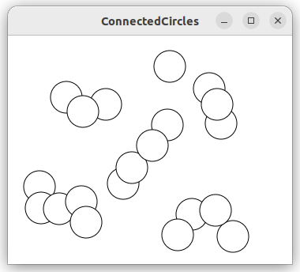
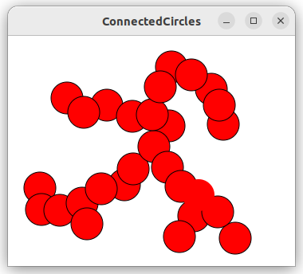
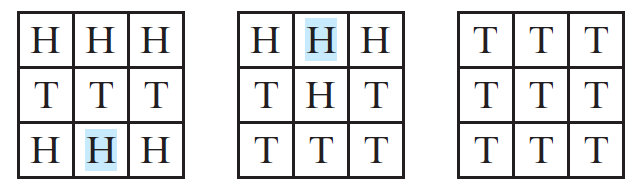
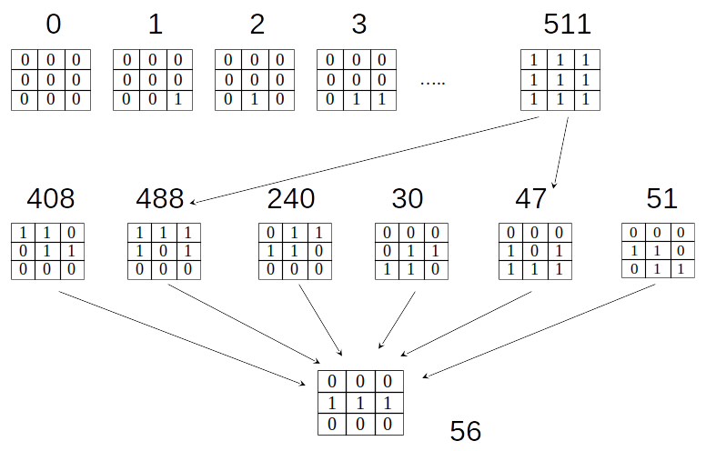

# Graphs and Applications


Objectives
---
- Describe graphs with
  - vertices, edges, simple graphs, weighted/unweighted graphs 
  - directed/undirected graphs
  - visualize graphs
- Design and implement 
  - graph using 
    - adjacency matrices
    - adjacency lists
  - two graph search algorithms
    - depth-first search
    - breadth-first search
- Design, implement and analyze algorithms for finding
  - a minimum spanning tree (MST)
  - single-source shortest paths
- Model and solve real-world problems with graphs
  - Seven Bridges of Königsberg problem
  - connected-circle problem
  - nine-tail problem


Basic Graph Terminologies 
---
| Term    | Definition     |
|-----|---------|
| **Graph (G)**        | A collection of `vertices (nodes)` and `edges (links)` that connect pairs of vertices.      |
| **Vertex (Node)**    | A fundamental unit of which graphs are formed, usually represented as a dot or circle.                     |
| **Edge (Link)**      | A connection between two vertices in a graph.                                                              |
| **Directed Graph**   | A graph in which edges have a direction, going from one vertex to another.                                 |
| **Undirected Graph** | A graph in which edges do not have a direction, meaning they can be traversed both ways.                   |
| **Weighted Graph**   | A graph in which edges have associated weights, typically representing costs, distances, or capacities.     |
| **Adjacency List**   | A way of representing a graph by listing each vertex and its adjacent vertices.                            |
| **Adjacency Matrix** | A 2D array representation of a graph where the cell at row i and column j indicates the presence of an edge.|
| **Degree**           | The number of edges incident to a vertex.                                                                  |
| **In-Degree**        | The number of edges directed into a vertex in a directed graph.                                            |
| **Out-Degree**       | The number of edges directed out of a vertex in a directed graph.                                          |
| **Path**             | A sequence of vertices where each adjacent pair is connected by an edge.                                   |
| **Cycle**            | A path that starts and ends at the same vertex, with all edges and vertices being distinct except for the endpoints. |
| **Connected Graph**  | A graph in which there is a path between every pair of vertices.                                           |
| **Disconnected Graph** | A graph in which at least one pair of vertices does not have a path connecting them.                     |
| **Complete Graph**   | A graph in which there is an edge between every pair of vertices.                                          |
| **Subgraph**         | A graph formed from a subset of the vertices and edges of another graph.                                   |
| **Tree**             | An acyclic connected graph.                                                                                |
| **Forest**           | A collection of disjoint trees.                                                                            |
| **Bipartite Graph**  | A graph whose vertices can be divided into two disjoint sets such that no two graph vertices within the same set are adjacent. |
| **Planar Graph**     | A graph that can be drawn on a plane without any edges crossing.                                           |
| **Graph Isomorphism** | A bijection between the vertex sets of two graphs that preserves the edge-vertex connectivity.            |
| **Eulerian Path**    | A path that visits every edge of a graph exactly once.                                                     |
| **Eulerian Circuit** | A circuit that visits every edge of a graph exactly once and starts and ends at the same vertex.           |
| **Hamiltonian Path** | A path that visits every vertex of a graph exactly once.                                                   |
| **Hamiltonian Circuit** | A circuit that visits every vertex of a graph exactly once and starts and ends at the same vertex.      |
| **Cut**              | A partition of the vertices of a graph into two disjoint subsets.                                          |
| **Clique**           | A subset of vertices of a graph such that every two distinct vertices are adjacent.                        |
| **Independent Set**  | A set of vertices in a graph, no two of which are adjacent.                                                |
| **Minimum Spanning Tree** | A subgraph of a weighted graph that connects all the vertices together without any cycles and with the minimum possible total edge weight. |
| **Shortest Path**    | The path between two vertices in a graph such that the sum of the weights of its constituent edges is minimized. |


Representing Graphs
---
| Feature                       | Adjacency List Representation         | Adjacency Matrix Representation       |
|-------------------------------|---------------------------------------|---------------------------------------|
| **Definition**                | Uses lists to represent which vertices are adjacent to each vertex | Uses a 2D array to represent edges between vertices |
| **Space Complexity**          | 𝐎(V + E)                              | 𝐎(V²)                                |
| **Edge Lookup Time Complexity** | 𝐎(V) in the worst case                | 𝐎(1)                                  |
| **Insertion Time Complexity** | 𝐎(1) to add an edge                   | 𝐎(1) to add an edge                   |
| **Deletion Time Complexity**  | 𝐎(V) to remove an edge                | 𝐎(1) to remove an edge                |
| **Ideal Use Case**            | Sparse graphs                         | Dense graphs                          |
| **Memory Efficiency**         | More efficient for sparse graphs      | Less efficient for sparse graphs      |
| **Implementation Complexity** | Moderate                              | Low                                   |
| **Traversal Efficiency**      | Efficient for iterating over neighbors| Efficient for checking edge existence |
| **Parallel Edge Handling**    | Typically requires additional data structure | Can handle with matrix values         |
| **Directed/Undirected Support** | Both                                  | Both                                  |
| **Weighted Graph Support**    | Supported (using pair/list with weights) | Supported (using matrix values)       |


💡 Intuition
---
- [Explore graph representations](https://csvistool.com/BFS)
  - Adjacency list representation
  - Adjacency matrix representation


🏃 Implementation
---
```c++
#include <iostream>
#include <vector>
#include <list>
#include <iomanip>
#include <algorithm>

template <typename T>
class Graph
{
public:
  Graph(int vertices);

  // Methods for Adjacency List representation
  void addEdgeAdjList(T src, T dest);
  void printAdjList();

  // Methods for Adjacency Matrix representation
  void addEdgeAdjMatrix(T src, T dest);
  void printAdjMatrix();

private:
  int vertices;
  std::vector<std::list<T>> adjList;
  std::vector<std::vector<int>> adjMatrix;
  std::vector<T> vertexLabels;
  int getVertexIndex(T vertex);
};

// Constructor
template <typename T>
Graph<T>::Graph(int vertices) : vertices(vertices)
{
  adjList.resize(vertices);
  adjMatrix.resize(vertices, std::vector<int>(vertices, 0));
  vertexLabels.resize(vertices);
}

// Method to get the index of a vertex
template <typename T>
int Graph<T>::getVertexIndex(T vertex)
{
  auto it = std::find(vertexLabels.begin(), vertexLabels.end(), vertex);
  if (it != vertexLabels.end())
  {
    return std::distance(vertexLabels.begin(), it);
  }
  else
  {
    for (int i = 0; i < vertexLabels.size(); ++i)
    {
      if (vertexLabels[i] == T())
      {
        vertexLabels[i] = vertex;
        return i;
      }
    }
  }
  return -1; // Should never reach here if used correctly
}

// Method to add an edge to the Adjacency List
template <typename T>
void Graph<T>::addEdgeAdjList(T src, T dest)
{
  int srcIndex = getVertexIndex(src);
  int destIndex = getVertexIndex(dest);
  adjList[srcIndex].push_back(dest);
  adjList[destIndex].push_back(src); // For undirected graph
}

// Method to print the Adjacency List
template <typename T>
void Graph<T>::printAdjList()
{
  std::cout << "Adjacency List Representation:\n";
  for (int i = 0; i < vertices; ++i)
  {
    std::cout << vertexLabels[i] << ": ";
    for (T vertex : adjList[i])
    {
      std::cout << vertex << " ";
    }
    std::cout << std::endl;
  }
}

// Method to add an edge to the Adjacency Matrix
template <typename T>
void Graph<T>::addEdgeAdjMatrix(T src, T dest)
{
  int srcIndex = getVertexIndex(src);
  int destIndex = getVertexIndex(dest);
  adjMatrix[srcIndex][destIndex] = 1;
  adjMatrix[destIndex][srcIndex] = 1; // For undirected graph
}

// Method to print the Adjacency Matrix
template <typename T>
void Graph<T>::printAdjMatrix()
{
  std::cout << "Adjacency Matrix Representation:\n";
  for (int i = 0; i < vertices; ++i)
  {
    std::cout << vertexLabels[i] << ": ";
    for (int j = 0; j < vertices; ++j)
    {
      std::cout << std::setw(3) << adjMatrix[i][j];
    }
    std::cout << std::endl;
  }
}

int main()
{
  int vertices = 5; // Number of vertices in the graph
  Graph<std::string> graph(vertices);

  // Adding edges
  graph.addEdgeAdjList("A", "B");
  graph.addEdgeAdjList("A", "E");
  graph.addEdgeAdjList("B", "C");
  graph.addEdgeAdjList("B", "D");
  graph.addEdgeAdjList("B", "E");
  graph.addEdgeAdjList("C", "D");
  graph.addEdgeAdjList("D", "E");

  graph.addEdgeAdjMatrix("A", "B");
  graph.addEdgeAdjMatrix("A", "E");
  graph.addEdgeAdjMatrix("B", "C");
  graph.addEdgeAdjMatrix("B", "D");
  graph.addEdgeAdjMatrix("B", "E");
  graph.addEdgeAdjMatrix("C", "D");
  graph.addEdgeAdjMatrix("D", "E");

  // Printing graph representations
  graph.printAdjList();
  std::cout << std::endl;
  graph.printAdjMatrix();

  return 0;
}
```


Graph Traversals
---
| Feature   | [Breadth-First Traversal (BFT)](https://en.wikipedia.org/wiki/Breadth-first_search)    | [Depth-First Traversal (DFT)](https://en.wikipedia.org/wiki/Depth-first_search)  |
|--------|--------------|------------------|
| **Definition**    | Traverses the graph level by level, exploring all neighbors of a vertex before moving to the next level. | Traverses the graph by exploring as far as possible along each branch before backtracking. |
| **Steps**         | 1. Initialize a queue and mark the start vertex as visited. <br> 2. Enqueue the start vertex. <br> 3. While the queue is not empty: <br> &nbsp;&nbsp;a. Dequeue a vertex. <br> &nbsp;&nbsp;b. Visit all its unvisited neighbors, mark them as visited, and enqueue them. | 1. Initialize a stack and mark the start vertex as visited. <br> 2. Push the start vertex onto the stack. <br> 3. While the stack is not empty: <br> &nbsp;&nbsp;a. Pop a vertex from the stack. <br> &nbsp;&nbsp;b. Visit all its unvisited neighbors, mark them as visited, and push them onto the stack. |
| **Time complexity** | 𝐎(V+E) |  𝐎(V+E) |
| **Applications**  | - Finding the shortest path in an unweighted graph. <br> - Level-order traversal of a tree. <br> - Finding connected components in an undirected graph. | - Topological sorting of a directed graph. <br> - Solving puzzles and games (e.g., maze solving). <br> - Finding strongly connected components in a directed graph.  |


Pseudo-code for recursive  DFT
---
```c++
procedure DFS(G, v) is
    label v as discovered
    for all directed edges from v to w that are in G.adjacentEdges(v) do
        if vertex w is not labeled as discovered then
            recursively call DFS(G, w)
```

🏃 Implementation
---
```c++
template <typename T>
void Graph<T>::DFT(T vertex, std::unordered_set<T> &visited)
{
  visited.insert(vertex);
  std::cout << vertex << " ";

  for (const T &neighbor : adjList[vertex])
  {
    if (visited.find(neighbor) == visited.end())
    {
      DFT(neighbor, visited);
    }
  }
}
```

Pseudo-code for stack-based DFT
---
```c++
procedure DFT_iterative(G, v) is
    let S be a stack
    S.push(v)
    while S is not empty do
        v = S.pop()
        if v is not labeled as discovered then
            label v as discovered
            for all edges from v to w in G.adjacentEdges(v) do 
                S.push(w)
```                

🏃 Implementation
---
```c++
template <typename T>
void Graph<T>::DFT(T start)
{
  std::unordered_set<T> visited;
  std::stack<T> stack;

  stack.push(start);

  while (!stack.empty())
  {
    T vertex = stack.top();
    stack.pop();

    if (visited.find(vertex) == visited.end())
    {
      std::cout << vertex << " ";
      visited.insert(vertex);
    }

    for (const T &neighbor : adjList[vertex])
    {
      if (visited.find(neighbor) == visited.end())
      {
        stack.push(neighbor);
      }
    }
  }
  std::cout << std::endl;
}
```


💡 Intuition
---
- [Graph DFT](https://csvistool.com/DFS)


Applications of DFT
---
- Detecting whether a graph is connected
  - Finding all connected components
- Detecting whether there is a path between two vertices
  - Finding a path between two vertices
- Detecting whether there is a cycle in the graph
  - Finding a cycle in the graph
  - Finding a Hamiltonian path/cycle


Pseudo-code for BFT 
---
```c++
procedure BFS(G, root) is
     let Q be a queue
     label root as explored
     Q.enqueue(root)
     while Q is not empty do
         v := Q.dequeue()
         if v is the goal then
             return v
         for all edges from v to w in G.adjacentEdges(v) do
             if w is not labeled as explored then
                 label w as explored
                 w.parent := v
                 Q.enqueue(w)
```

🏃 Implementation
---
```c++
template <typename T>
void Graph<T>::BFT(T start)
{
  std::unordered_set<T> visited;
  std::queue<T> queue;

  visited.insert(start);
  queue.push(start);

  while (!queue.empty())
  {
    T vertex = queue.front();
    queue.pop();
    std::cout << vertex << " ";

    for (const T &neighbor : adjList[vertex])
    {
      if (visited.find(neighbor) == visited.end())
      {
        visited.insert(neighbor);
        queue.push(neighbor);
      }
    }
  }
  std::cout << std::endl;
}
```


💡 Intuition
---
- [Graph BFT](https://csvistool.com/BFS)


Applications of BFT
---
- Detecting whether a graph is connected
  - Finding all connected components
  - Testing whether a graph is bipartite
- Detecting whether there is a path between two vertices
  - Finding a shortest path between two vertices
- Detecting whether there is a cycle in the graph
  - Finding a cycle in the graph


🏃 Implement BFT and DFT
---
- [Graph is represented with adjacency matrix](./demos/gtm.cpp)
  - [Stack-based DFT](./demos/sgm.cpp)
- [Graph is represented with adjacency list](./demos/gta.cpp)
  - [Stack-based DFT](./demos/sga.cpp)


Shortest paths of a weighted graph
---
- Each edge of a `weighted graph` has an associated numerical value, called a `weight`
  - These weights often represent costs, distances, or any other metric that `quantifies the relationship` between the connected vertices
- Weighted graphs can be either directed or undirected
- In the `shortest path between two vertices`, `the sum of the weights` of its constituent edges is minimized


Algorithms of finding shortest paths
---
| Feature  | [Dijkstra's Algorithm](https://en.wikipedia.org/wiki/Dijkstra%27s_algorithm)   | [Bellman-Ford Algorithm](https://en.wikipedia.org/wiki/Bellman%E2%80%93Ford_algorithm)   | [Floyd-Warshall Algorithm](https://en.wikipedia.org/wiki/Floyd%E2%80%93Warshall_algorithm)  |
|-----|---------|-----|---------|
| **Use Case**   | Single-source shortest paths with non-negative weights | Single-source shortest paths, allows negative weights | All-pairs shortest paths  |
| **Graph Type**   | Directed or undirected   | Directed or undirected  | Directed or undirected  |
| **Edge Weights**   | Non-negative   | Can be negative  | Can be negative   |
| **Complexity** | $O((V + E) \log V)$ with a priority queue | $O(V \cdot E)$    | $O(V^3)$    |
| **Data Structures Used** | Priority queue, adjacency list| Adjacency list or matrix   | Distance matrix    |
| **Negative Weight Cycles** | Cannot handle  | Can detect and report  | Cannot handle  |
| **Steps**  | 1. Initialize distances from source to all vertices as infinite, distance to source as 0.<br>2. Use priority queue to select vertex with smallest distance.<br>3. Update distances to its neighbors.<br>4. Repeat until all vertices are processed. | 1. Initialize distances from source to all vertices as infinite, distance to source as 0.<br>2. Relax all edges $V-1$ times.<br>3. Check for negative-weight cycles by relaxing all edges one more time. | 1. Initialize distance matrix with edge weights, 0 for diagonal.<br>2. Update distances considering all pairs of vertices through an intermediate vertex.<br>3. If path through intermediate vertex is shorter, update distance matrix. |
| **Advantages**  | Efficient for graphs with non-negative weights | Can handle graphs with negative weights, detects negative cycles | Computes shortest paths between all pairs of vertices |
| **Disadvantages**   | Cannot handle negative weight edges   | Less efficient for large graphs with no negative weights | High time complexity for large graphs |


💡 Intuition for Dijkstra's Algorithm
---
- [Animation](https://csvistool.com/Dijkstra)


Pseudo code for Dijkstra's Algorithm
---
```c++
 1  function Dijkstra(Graph, source):
 2     
 3      for each vertex v in Graph.Vertices:
 4          dist[v] ← INFINITY
 5          prev[v] ← UNDEFINED
 6          add v to Q
 7      dist[source] ← 0
 8     
 9      while Q is not empty:
10          u ← vertex in Q with minimum dist[u]
11          remove u from Q
12         
13          for each neighbor v of u still in Q:
14              alt ← dist[u] + Graph.Edges(u, v)
15              if alt < dist[v]:
16                  dist[v] ← alt
17                  prev[v] ← u
18
19      return dist[], prev[]
```


🏃 Implementation of Dijkstra's Algorithm
---
- [Graph is represented with adjacency list](./demos/djadj.cpp)
- [Graph is represented with adjacency matrix](./demos/djmx.cpp)


Minimum Spanning Tree (MST)
---
- A Minimum Spanning Tree (MST) is a `subset of the edges` of a `connected, undirected graph` that `connects all the vertices` together
  - without any cycles, and with the minimum possible total edge weight
- It is a spanning tree whose sum of edge weights is the minimum


MST Algorithms
---
| Feature  | [Prim's Algorithm](https://en.wikipedia.org/wiki/Prim%27s_algorithm) | [Kruskal's Algorithm](https://en.wikipedia.org/wiki/Kruskal%27s_algorithm)  | [Borůvka's Algorithm](https://en.wikipedia.org/wiki/Bor%C5%AFvka%27s_algorithm)  |
|-----|------|-------|-------|
| **Use Case**   | Efficient for dense graphs with lots of edges  | Efficient for sparse graphs with fewer edges   | Efficient for parallel processing and distributed computing  |
| **Graph Type**   | Undirected, connected   | Undirected, connected    | Undirected, connected  |
| **Data Structures Used**  | Min-heap (priority queue), adjacency list  | Disjoint-set (union-find), edge list   | Disjoint-set (union-find), edge list  |
| **Complexity**   | $O(E \log V)$ using min-heap  | $O(E \log E)$ or $O(E \log V)$ using union-find| $O(E \log V)$ using union-find  |
| **Approach**  | Greedy algorithm that grows the MST one vertex at a time  | Greedy algorithm that adds the smallest edge that does not form a cycle | Greedy algorithm that grows many components simultaneously  |
| **Steps**  | 1. Initialize all keys to infinity, except for the start vertex (set to 0).<br>2. Use a min-heap to pick the vertex with the smallest key.<br>3. Update the keys of adjacent vertices.<br>4. Repeat until all vertices are included in the MST. | 1. Sort all edges in non-decreasing order of their weight.<br>2. Pick the smallest edge that does not form a cycle with the MST formed so far.<br>3. Use union-find to detect and avoid cycles.<br>4. Repeat until $V-1$ edges are included in the MST. | 1. Start with each vertex as a separate component.<br>2. Add the smallest edge connecting two different components.<br>3. Use union-find to manage components.<br>4. Repeat until there is only one component. |
| **Advantages**   | Efficient for dense graphs, easy to implement with adjacency lists | More efficient for sparse graphs, can be easily implemented with sorting algorithms | Good for parallel processing, works in stages  |
| **Disadvantages**   | Less efficient for sparse graphs, requires a priority queue | Requires sorting of edges, less efficient for dense graphs | Less commonly used, can be more complex to implement |


💡 Intuition for Prim's Algorithm
---
- [Animation](https://csvistool.com/Prim)

Pseudo code for Prim's Algorithm
---
```c++
procedure Prims(Vertex start, Graph g):
  initialize a visited set
  initialize an edge set MST
  initialize a priority queue
  add start to visited set

  for each edge adjacent to start vertex in g:
    enqueue edge
  end for

  while (queue is not empty && visited set is not full)
    dequeue edge between vertices v,w
    add edge to MST
    add w to visited set
    for each edge adjacent to w:
      if (other endpoint vertex is not visited):
        enqueue edge between w and other endpoint vertex
      end if
    end for
  end while
  return MST
end procedure
```


🏃 Implementation of Prim's Algorithm
---
- [Graph is represented with adjacency list](./demos/pmadj.cpp)
- [Graph is represented with adjacency matrix](./demos/pmmx.cpp)


💡 Intuition for Kruskal's Algorithm
---
- [Animation](https://csvistool.com/Kruskal)


Pseudo code for Kruskal's Algorithm
---
```c++
procedure Kruskals(Graph g):
  initialize a disjoint set with all vertices in g
  initialize an edge set MST
  initialize a priority queue with all edges in g

  while (queue is not empty && MST has edges fewer than n-1)
    dequeue edge between vertices v,w
    if (v and w are not in the same set):
      add edge to MST
      merge v's set with w's set in the disjoint set structure
    end if
  end while
end procedure
```


🏃 Implementation of Kruskal's Algorithm
---
- [Graph is represented with adjacency list](./demos/kradj.cpp)
- [Graph is represented with adjacency matrix](./demos/krmx.cpp)


🏃 Application: Solve The Connected Circles Problem
---
| unconnected | connected |
|:---:|:---:|
|  |  |


🏃 Application: Solve The Nine Tail Problem 
---


- Nine coins in a 3x3 matrix 
  - some face up and some face down
- legal move
  - reverse a H together with its adjacent neighbors (no diagonally adjacent) 
- goal
  - find the minimum number of moves that lead to all T
- model the problem with a directed graph
  - each state represented by a node
    - all T is the target node $t$
    - starting state node $s$
  - $u\rightarrow v$ means there is a legal move change $u$ to $v$
  - turn the problem to 
    - find the shortest path from $s$ to $t$ in a BFS tree rooted at $t$




🏃 Application: Solve The Weighted Nine Tail Problem 
---
- The number of the flips as the weight on each move


# Online resources
- [visualgo](https://visualgo.net/)
- [Liang animation](https://liveexample.pearsoncmg.com/liang/animation/animation.html)