# [Red-Black Trees](https://en.wikipedia.org/wiki/Red%E2%80%93black_tree)

Objectives
---
- Describe red-black trees
- Convert a red-black tree to a 2-4 tree and vice versa
- Design, implement and test red-black tree
  - Insert elements in a red-black tree and solve the possible problems
    - double red problem
    - double black problem
- Compare the performance of AVL trees, 2-4 trees and red-black trees


What is a Red Black Tree? 
---
- A binary search tree derived from a 2-4 tree
- Each node has a color attribute red or black
  - The root is black
  - Two adjacent nodes cannot be both red

| A red-black tree | Equivalent 2-4 tree |
| --- | --- |
| 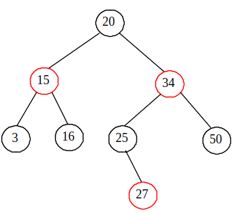 | 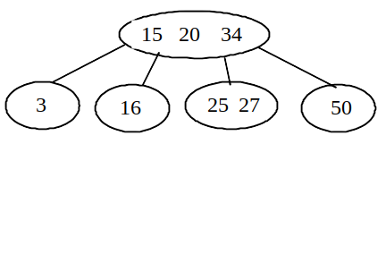 |

- A node is called *external* if its left or right subtree is empty
  - a leaf node is external
  - an external node is not necessarily a leaf node
- The `black depth of a node` = the `number of black nodes` in the path from the node to the root
  - `All external nodes` have the `same black depth`


🏃 Practice
---
Randomly generate a red-black tree on the [animator](https://kubokovac.eu/gnarley-trees/Redblack.html), then
- Find all external nodes
- Find all nonleaf external nodes
- Find the black depth of each node


Conversion between Red-Black Trees and 2-4 Trees 
---
- ❶ Red-black tree to 2-4 tree 
  - merge any red nodes with its parent to create a 3-node or a 4-node
- ❷ 2-4 tree to red-black tree
  - perform the transformations for each node $u$
    - (a) if $u$ is a 2-node , color it black
    - (b) if $u$ is a 3-node contains  $e_0, e_1$
      - make $e_0$ the parent of $e_1$ or vice versa
      - color the parent black and the child red
    - (c) if $u$ is a 4-node contains  $e_0, e_1,e_2$
      - make $e_1$ the parent of $e_0$ and $e_2$
      - color the parent $e_1$ black and the children $e_0$ and $e_2$ red
  - 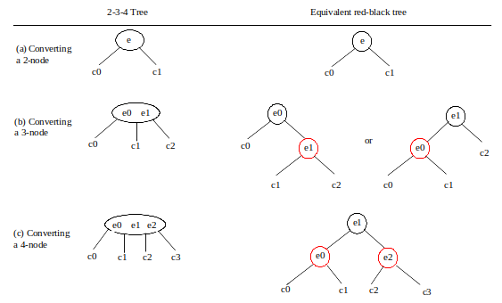
  - ⚠️ The conversion from a 2-4 tree to red-black tree is *not unique*
  - 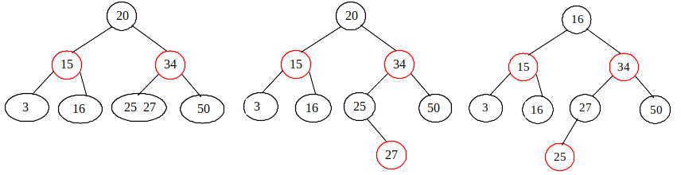


🏃 Practice
---
1. Randomly generate a red-black tree on the [animator](https://kubokovac.eu/gnarley-trees/Redblack.html), then
   - Convert it to a 2-4 tree
   - Convert the result 2-4 tree back to a red-black tree
2. Randomly generate a red-black tree on the [animator](https://kubokovac.eu/gnarley-trees/234tree.html), then
   - Convert it to a red-black tree
   - Convert the result red-black tree back to a 2-4 tree 


Insert an element ℯ into a red-black tree
---
- Always insert $e$ as a leaf node
  - Color it black if the new node $u$ is the root otherwise red
- If the parent $v$ of $u$ is red, a *double-red violation* occurs
- Fix the violation in two cases: let $w$ be the parent of $v$, $x$ the sibling of $v$
  - **Case 1**: 
    - $x$ is black or null then 
    - There are 4 possible configurations for $u,v,w,x$ shown as (a)s below
      - in which $y_1, y_2, y_3$ may be null
    - $u,v,w$ form a 4-node in the corresponding 2-4 tree 
      - but represented incorrectly in the red-black tree
    - case 1.1: $u \lt v \lt w$
      - 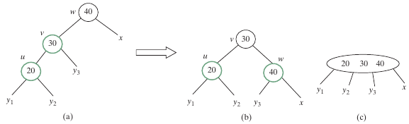
    - case 1.2: $v \lt u \lt w$
      - 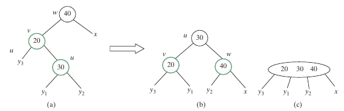
    - case 1.3: $w \lt v \lt u$
      - 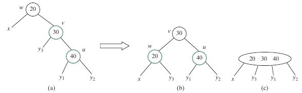
    - case 1.4: $w \lt u \lt v$
      - 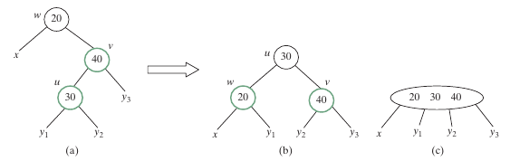
  - **Case 2**: 
    - $x$ is red then 
    - There are 4 possible configurations for $u,v,w,x$ shown as below
      - each corresponds to an overflow in the corresponding 4-node in a 2-4 tree
      - 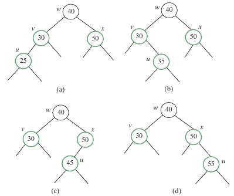
    - *Operation split* fixes overflow in the 2-4 tree 
      - Equivalent recolor fixes double-red violation in the red-black tree
      - now $w$ is red
        - if $parentOfw$ is black, done
        - otherwise, a new double-red violation occurs at $w$
          - use the same process to fix the violation *recursively*
      - 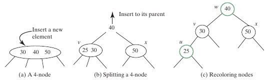


```c++

```

Practice 📝
---
- Try common operations on a red-black tree with [animator](https://kubokovac.eu/gnarley-trees/Redblack.html)
  - insert into an empty red-black tree with 
    -  34, 3, 50, 20, 15 , 16, 25, and 27
  - describe the changes in each insert


Remove an element ℯ from a red-black tree
---
- Search and locate the node $u$ with the element $e$
  - if $e$ is not in the tree, return false
- If $u$ is an internal node with both left and right children
  - find the rightmost node $v$ in the left subtree of $u$
  - replace $e$ in $u$ with the element in $v$
- If $u$ is an external node
  - then it has at most one child $childOfu$ 
    - which may be empty
  - delete $u$ by connecting $childOfu$ with $parentOfu$
  - 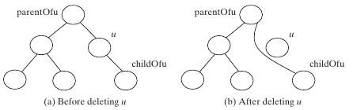
  - Consider the following cases
    - If $u$ is red, done
    - If $u$ is black and $childOfu$ is red, 
      - color $childOfu$ black to maintain the black height of $childOfu$ 
    - otherwise, assign $childOfu$ a fictitious *double black* as (a) in the table below
      - which is called a *double-black problem*
        - the black depth is shorten by 1

| (a) childOfu is denoted double black | (b) u corresponds to an empty node in a 2-4 tree |
| --- | --- |
| 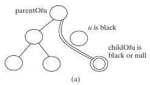  | 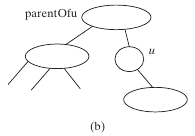  |

- A double black  in a red-black tree corresponds to an empty node for u in the corresponding 2-4 tree as (b) in the table above
  - can be fixed by equivalent transfer and fusion operations with three cases
  - **Case 1**: The sibling $y$ of childOfu is black and has a red child
    - This case has four possible configurations shown in the (a)s below
      - The dashed ­circle denotes that the node is either red or black
      - Case 1.1: The sibling $y$ of $childOfu$ is black and $y_1$ is red
      - 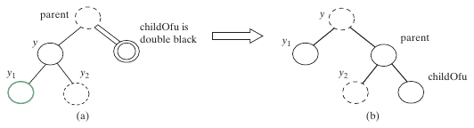
      -  Case 1.2: The sibling $y$ of $childOfu$ is black and $y_2$ is red
      - 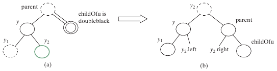
      -  Case 1.3: The sibling $y$ of $childOfu$ is black and $y_1$ is red
      - 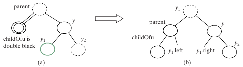 
      -  Case 1.4: the sibling $y$ of $childOfu$ is black and $y_2$ is red
      - 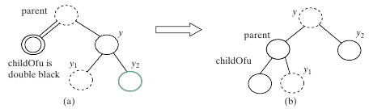 
    - case 1 corresponds to a transfer operation in the corresponding 2-4 tree
    - 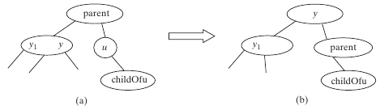
  - **Case 2**: The sibling $y$ of $childOfu$ is black and its children are black or null
    - change $y$’s color to red
      - If parent is red, change it to black, done
        - 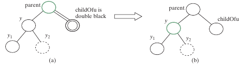
      - If parent is black, we denote parent double black
        - The double-black problem propagates to the parent node
        - 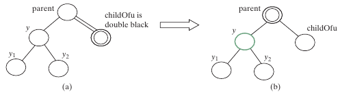
      - Case 2 corresponds to a fusion operation in the corresponding 2-4 tree
        - 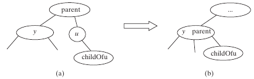
  - **Case 3**: The sibling $y$ of $childOfu$ is red, perform an adjustment operation
    - If $y$ is a left child of parent
    - 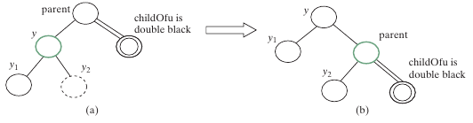
    - If y is a right children of parent
    - 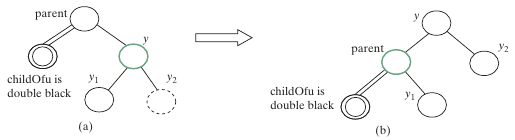
    - In both cases, color $y$ black and parent red 
      - $childOfu$ is still a fictitious double-black node
      - After the adjustment, the sibling of $childOfu$ is now black, and either Case 1 or Case 2 applies
        - If Case 1 applies, 
          - a one-time restructuring and recoloring operation eliminates the double-black problem 
        - If Case 2 applies, 
          - the double-black problem cannot reappear, since parent is now red
      - Therefore, one-time application of Case 1 or Case 2 will complete Case 3
    - Case 3 results from the fact that a 3-node may be transformed in two ways to a red-black tree
      - 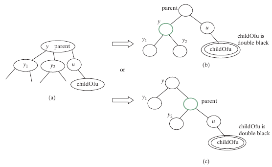

```c++

```


Practice 📝
---
- Follow the previous practice 
  - delete elements below from the red-black tree one by one
    - 50, 20, 15, 3, 25, 16, 34, 27
  - describe the changes in each delete


Performance of AVL trees, 2-4 trees and red-black trees
---
| methods | red-black tree | 2-4 tree | AVL tree | 
| --- | --- | --- | --- |
| search(e: E) | $O(\log n)$ | $O(\log n)$ | $O(\log n)$ |
| insert(e: E) | $O(\log n)$ | $O(\log n)$ | $O(\log n)$ |
| delete(e: E) | $O(\log n)$ | $O(\log n)$ | $O(\log n)$ |
| getSize() | $O(1)$ | $O(1)$ | $O(1)$ |
| isEmpty() | $O(1)$ | $O(1)$ | $O(1)$ |


- The height of a red-black tree is at most twice the height of its corresponding 2-4 tree
- Even though the three types of trees has same time complexity, but
  - Red-black tree is more efficient than the other two for insert and delete
    - It required only one-time restructuring of the nodes
    - A 2-4 tree may require many splits
- As a binary research tree, red-black tree is more space-efficient than a 2-4 tree
  - A 2-4 tree wastes space for 2- and 3-nodes since its node can hold up to 3 elements


# Online resources
- [visualgo](https://visualgo.net/)
- [Liang animation](https://liveexample.pearsoncmg.com/liang/animation/animation.html)